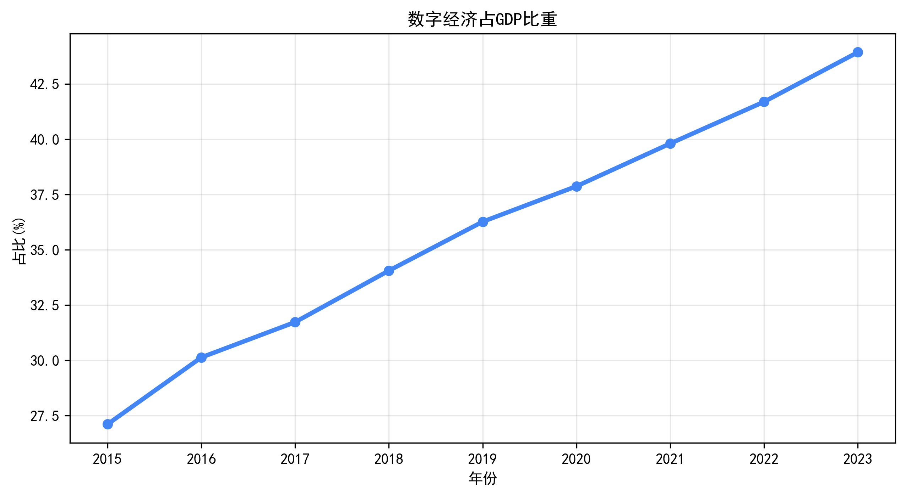
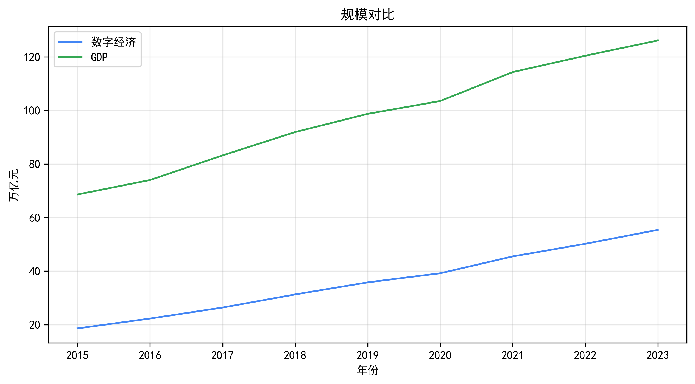
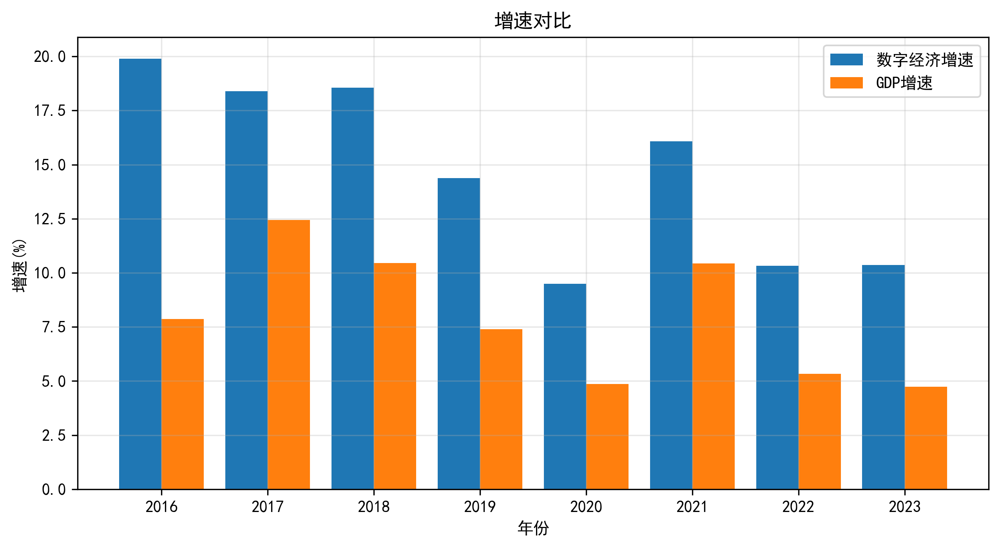
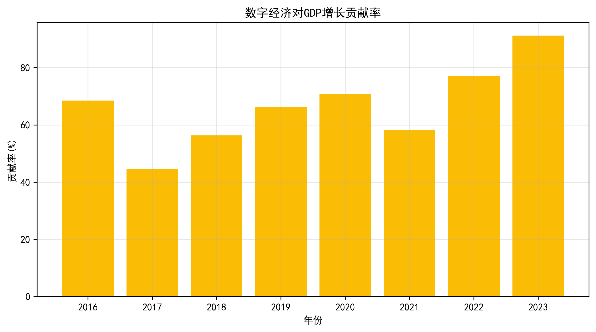

# 中国数字经济占GDP比重分析（2015-2023）
> 基于中国信通院公开数据的 Python 数据分析项目 | 数字经济 + 宏观经济分析

## 📌 项目背景
数字经济已成为中国经济增长的核心引擎，本项目通过分析2015-2023年数字经济规模及GDP数据，量化其对国民经济的贡献度变化，验证数字经济的核心增长动力地位。

## 🛠️ 技术栈
- **语言**：Python 3.x
- **数据处理**：Pandas
- **可视化**：Matplotlib
- **数据来源**：中国信通院《中国数字经济发展白皮书》

## 📊 数据说明
| 字段 | 含义 |
|------|------|
| 年份 | 2015-2023年时间序列 |
| 数字经济规模(万亿元) | 中国信通院公布的全国数字经济总规模 |
| GDP(万亿元) | 对应年份全国GDP总量 |
| 占GDP比重(%) | 数字经济规模 / GDP总量 * 100 |
| 数字经济增速(%) | 数字经济规模同比增长率 |
| GDP增速(%) | GDP总量同比增长率 |
| 对GDP增长贡献率(%) | 数字经济增量 / GDP增量 * 100 |

## 🎯 核心分析
1.  **占比提升**：数字经济占GDP比重从2015年的27.1%稳步提升至2023年的43.9%，年均增速约2%，逐步成为国民经济核心组成部分。
2.  **规模领先**：2015-2023年数字经济规模增幅达198%，显著高于同期GDP增幅（84%），展现出更强的增长动能。
3.  **增速领跑**：数字经济增速持续领先GDP增速5-8个百分点，体现出数字经济的高活力与高成长性。
4.  **核心贡献**：数字经济对GDP增长的贡献率长期维持在50%以上，部分年份接近70%，是拉动经济增长的关键引擎。

## 📈 可视化结果





## 🚀 快速运行
1.  安装依赖：
   ```bash
   pip install pandas matplotlib openpyxl
